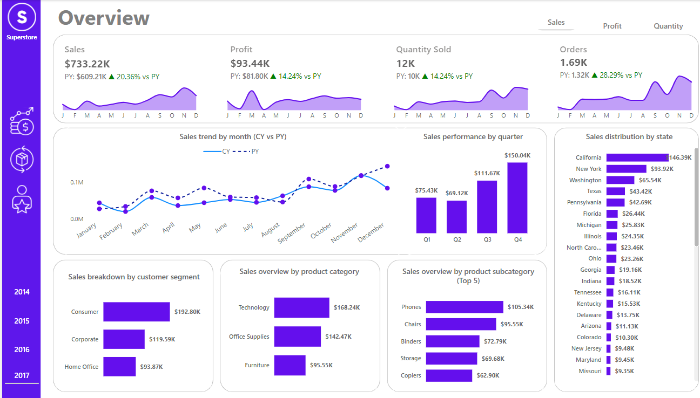

<!DOCTYPE html>
<html lang="en">
<body>
    <h1>📊 Sales Analytics Dashboard</h1>

   

        <h2>📄 Description</h2>
        
This project focuses on analyzing sales performance data for a fictional superstore to uncover actionable insights. By leveraging data cleaning, visualization, and modeling techniques, the project provides a detailed examination of the store's operations, products, and customers. The insights aim to help decision-makers optimize product portfolios, improve regional sales strategies, and enhance customer retention.

        
The analysis was conducted using tools such as Power BI for creating interactive dashboards. The final deliverables include three dynamic dashboards that summarize key findings.

    

  

        <h2>🛠️ Skills Acquired from This Project</h2>
        <ul>
            <li><b>Power BI Mastery:</b> Designed and developed interactive, visually compelling dashboards and reports.</li>
            <li><b>DAX Expertise:</b> Created custom calculations and measures to deliver complex analytics.</li>
            <li><b>Data Modeling:</b> Built efficient relationships and hierarchies for seamless analysis.</li>
            <li><b>Power Query Proficiency:</b> Transformed raw data into actionable, reliable datasets.</li>
            <li><b>Data Visualization:</b> Crafted impactful visuals to effectively communicate insights.</li>
            <li><b>Attention to Detail:</b> Ensured data accuracy and integrity throughout the project lifecycle.</li>
        </ul>
    

  

        <h2>🧹 Data Cleaning Process</h2>
        <ul>
            <li><b>Removed Duplicated Values:</b> Identified and eliminated duplicate records to maintain data integrity.</li>
            <li><b>Formatted Columns:</b> Standardized and formatted columns to the correct data types (e.g., dates, numbers, text) to ensure consistency and usability.</li>
            <li><b>Renamed and Cleaned Fields:</b> Renamed columns for clarity and ensured consistent naming conventions throughout the dataset.</li>
            <li><b>Created Customers and Products Dimension Tables:</b> Separated the Sales table into Fact (Sales) and Dimension (Customers, Products) tables to streamline the model and enable efficient filtering.</li>
        </ul>
    

   

        <h2>📐 Data Modeling Process</h2>
        
<b>The Fact Table (Sales)</b> serves as the central hub, containing transactional data. It connects to Dimension Tables (Customers, Products, and Regions) via a star schema, facilitating seamless filtering and analysis by time, geography, and product category.

        
<b>A Calendar Table</b> was created to facilitate time-based analysis. It includes fields such as Day, Month, Month Number, Quarter, and Year, enhancing the ability to track trends over specific periods.

        
<b>DAX Measures</b> such as Total Sales, Profit Margin, and YOY Growth were developed to provide actionable insights and performance tracking.

    

  

        <h2>📊 Dashboards</h2>

            <h3>📋 Overview Dashboard</h3>
            
            <h4>Key Metrics</h4>
            <ul>
                <li><b>Sales:</b> Year-specific revenue trends to evaluate growth and performance over time.</li>
                <li><b>Profit:</b> Profitability insights with the flexibility to analyze by individual years.</li>
                <li><b>Quantity Sold:</b> Annual breakdown of units sold for a clearer understanding of sales volume changes.</li>
                <li><b>Orders:</b> Yearly distribution of customer orders to identify patterns and seasonal trends.</li>
            </ul>

   <h4>Yearly and Monthly Trends</h4>
            <ul>
                <li><b>Sales Trend by Month (CY vs PY):</b> A line chart visualizing monthly sales performance, comparing the current year (CY) to the previous year (PY).</li>
                <li><b>Sales Performance by Quarter:</b> A bar chart comparing quarterly sales trends, showcasing Q4 as the strongest quarter across multiple years.</li>
            </ul>

  <h4>Regional and Customer Insights</h4>
            <ul>
                <li><b>Sales Distribution by State:</b> A horizontal bar chart identifying top-performing states for all years.</li>
                <li><b>Sales Breakdown by Customer Segment:</b> A stacked bar chart categorizing sales by customer segments for all years.</li>
            </ul>

   

            <h3>📦 Product Analysis Dashboard</h3>
            
The Product Analysis Dashboard provides an in-depth view of product performance, enabling stakeholders to assess sales, profit, and profitability trends over multiple years. It emphasizes top-performing products and subcategories, helping businesses make data-driven decisions to optimize inventory and drive growth.

            
    <h4>Key Metrics</h4>
            <ul>
                <li><b>Sales:</b> A breakdown of total revenue generated across different product categories and subcategories, with year-over-year comparisons.</li>
                <li><b>Profit:</b> Insights into profitability trends to identify high-margin products and underperforming items.</li>
                <li><b>Profit Margin:</b> A key indicator of product-level efficiency, offering a clear perspective on sales profitability.</li>
            </ul>
            <h4>Yearly and Category Trends</h4>
            <ul>
                <li><b>CY vs PY Sales Trends by Subcategory (Top 10):</b> A clustered column chart comparing current year (CY) and previous year (PY) sales performance for the top 10 product subcategories.</li>
                <li><b>Product Subcategory Performance Table:</b> A detailed table showing CY and PY sales for each subcategory, along with YoY growth rates.</li>
            </ul>
            <h4>Profitability and Performance Analysis</h4>
            <ul>
                <li><b>Sales vs. Profit Distribution:</b> A scatter plot visualizing the relationship between sales and profit for individual products.</li>
                <li><b>Best Products by Sales (Top 10):</b> A bar chart listing the top 10 products based on sales, profit, and quantity sold.</li>
            </ul>
        

        

            <h3>👥 Customer and Market Analysis Dashboard</h3>
            
The Customer and Market Analysis Dashboard provides a detailed breakdown of customer performance, regional contributions, and state-level insights. It highlights key customer metrics and geographic trends, offering actionable insights to optimize market strategies and enhance customer relationships.

           
          <h4>Key Metrics</h4>
            <ul>
                <li><b>Sales:</b> Overall revenue performance with year-over-year (YoY) comparisons to assess growth.</li>
                <li><b>Profit:</b> Profitability by customer and region, emphasizing high-value segments.</li>
                <li><b>Profit Margin:</b> Efficiency of sales across different customers and regions.</li>
                <li><b>Orders:</b> Total number of orders placed, helping to track engagement levels.</li>
                <li><b>Customers:</b> The count of active customers contributes to overall performance.</li>
            </ul>
            <h4>Customer Insights</h4>
            <ul>
                <li><b>Top 10 Customer Performance:</b> A table showcasing key metrics for the top-performing customers, including sales, profit, profit margin, and quantity sold.</li>
                <li><b>Distribution of Sales vs. Profit by Customer:</b> A scatter plot analyzing the relationship between sales and profit for individual customers.</li>
            </ul>
            <h4>Regional and State-Level Trends</h4>
            <ul>
                <li><b>Sales Contribution by Region:</b> A pie chart summarizing the percentage contribution of sales from each region (Central, South, East, and West).</li>
                <li><b>Profit Contribution by Region:</b> A pie chart detailing the percentage of profit contribution from each region.</li>
                <li><b>Quantity Contribution by Region:</b> A pie chart showing the percentage of quantity sold across regions.</li>
                <li><b>Sales Distribution Across States:</b> A U.S. map with state-wise shading to visually represent sales distribution.</li>
                <li><b>State-Level Performance Metrics:</b> A table listing key metrics (sales, profit, and quantity sold) for the top-performing states.</li>
            </ul>
        

    

</body>
</html>

</body>
</html>
